# **H&M Products Recommendation System**

## **Introduction**
The H&M Products Recommendation System aims to build a personalized recommendation engine for H&M customers. The goal is to recommend relevant products based on customers' past purchase history and product metadata. This project uses two primary recommendation techniques: **Collaborative Filtering (CF)** and **Content-Based Filtering (CB)**. Additionally, an **Autoencoder-based collaborative filtering model** is implemented to address matrix sparsity and cold start problems. The system can be deployed to recommend products through a user-friendly interface, ensuring that customers receive personalized suggestions based on their preferences.

## **Data Sets Provided**
The dataset consists of three main files:

- **articles.csv**: Contains detailed information about each article available for purchase.
- **customers.csv**: Contains customer-level data, including customer demographics, club membership status, and other attributes.
- **transactions_train.csv**: Contains the transaction history of customers, including the date of purchase, article purchased, and price.

## **Data Exploration**

### **Articles Dataframe**
The articles dataframe contains all H&M articles with detailed information such as product type, color group, garment group, and more. Key columns include:

- `article_id`: Unique identifier for each article.
- `product_code`, `prod_name`: Product code and name.
- `product_type_no`, `product_type_name`: Grouping of products by type.
- `colour_group_code`, `colour_group_name`: Grouping of articles by color.
- `department_no`, `department_name`: Department information for each product.

#### Key Insights:
1. A histogram of article types shows that **Ladieswear** accounts for a significant portion of the articles, while **Sportswear** has the least representation.
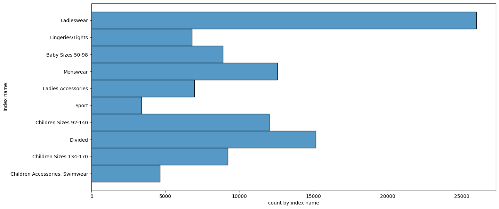
2. A stacked histogram of garment group names by index group reveals that **Jersey fancy** is the most frequent garment type, especially for women and children.
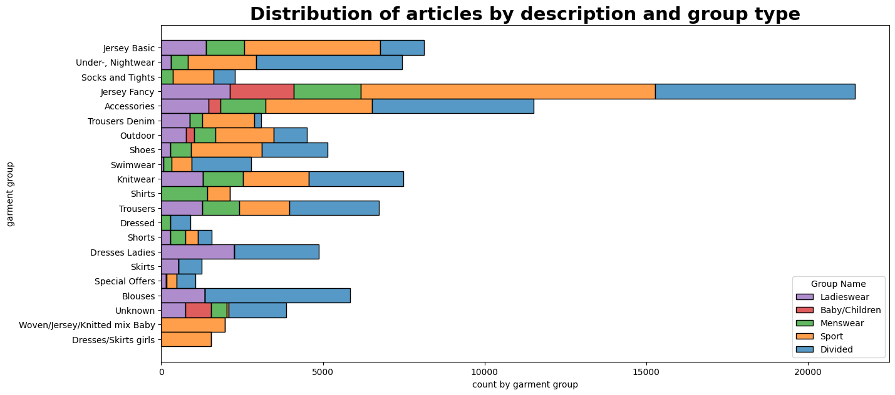
3. The structure of groups shows that Ladieswear and Children/Baby categories have subgroups with diverse product offerings.
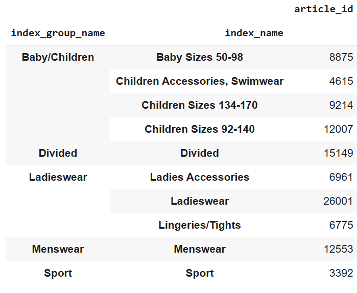
4. The product group-product structure. Accessories are really various, the most numerous: bags, earrings and hats.
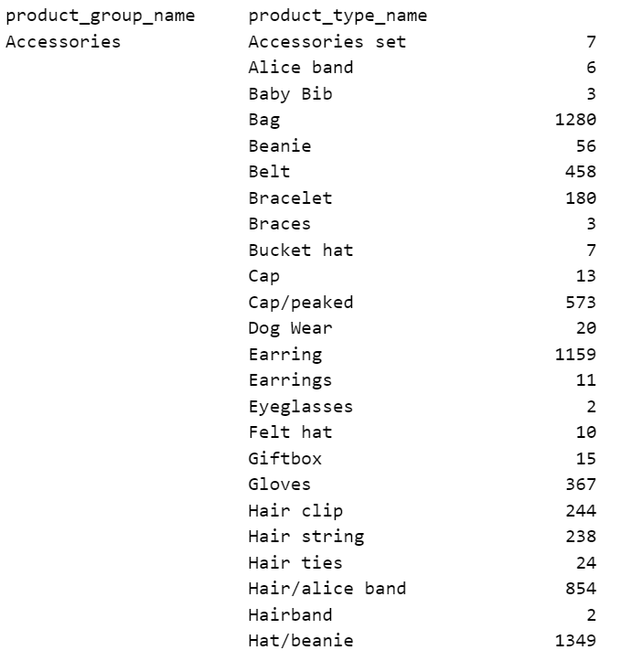

### **Customer Dataframe**
The customer dataframe provides demographic data about H&M customers. Key columns include:

- `customer_id`: Unique identifier for each customer.
- `club_member_status`: Indicates whether a customer is part of H&M’s club membership program.
- `fashion_news_frequency`: How often the customer receives fashion news updates from H&M.

#### Key Insights:
1. The age distribution of customers shows a concentration in the 20–40 age range, indicating that H&M's primary target audience is young adults(GenZ).
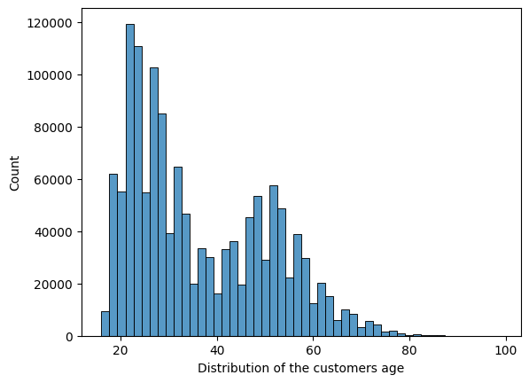

2. A pie chart shows the distribution of fashion news frequency among customers, with most customers receiving updates regularly or monthly.
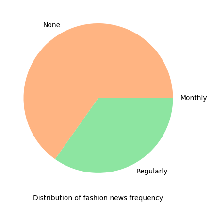

### **Transactions Dataframe**
The transactions dataframe contains historical purchase data. Key columns include:

- `t_dat`: Date of transaction.
- `customer_id`: Customer who made the purchase.
- `article_id`: Article purchased.
- `price`: Price paid for the article.

#### Key Insights:
1. Price outliers are plotted using boxplots to identify high-priced items across different categories. Accessories like bags show significant price variance compared to other categories like trousers or shoes.
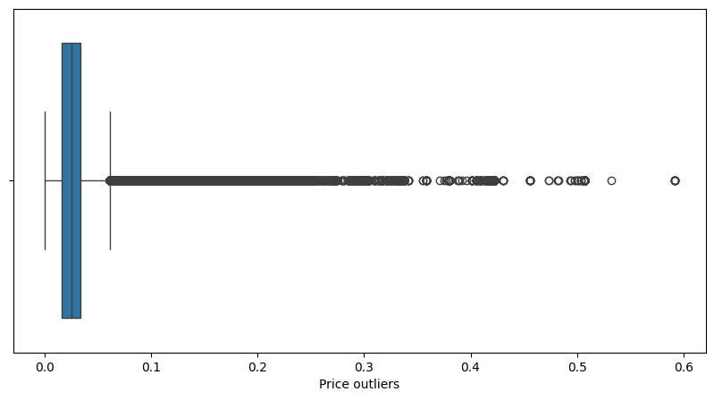
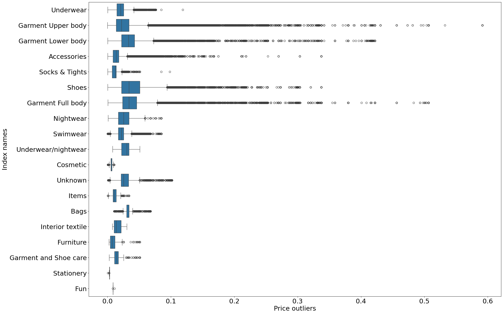
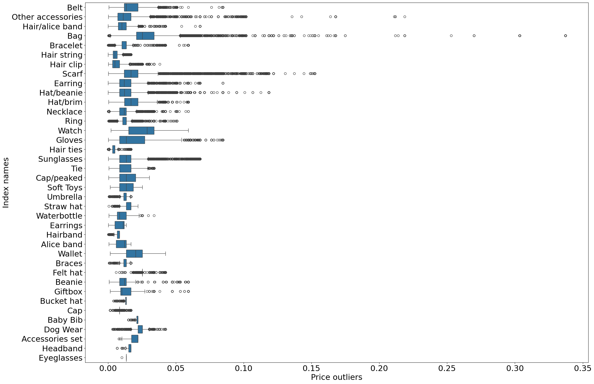
2. The index group with the highest mean price is Ladieswear, while Children’s wear has the lowest mean price.
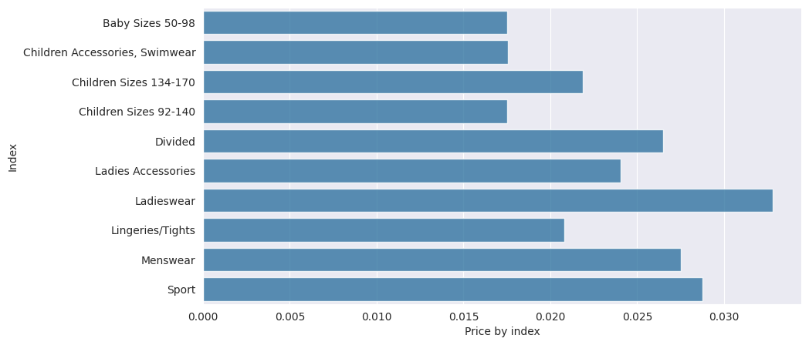
3. Stationery has the lowest mean price, the highest - shoes.
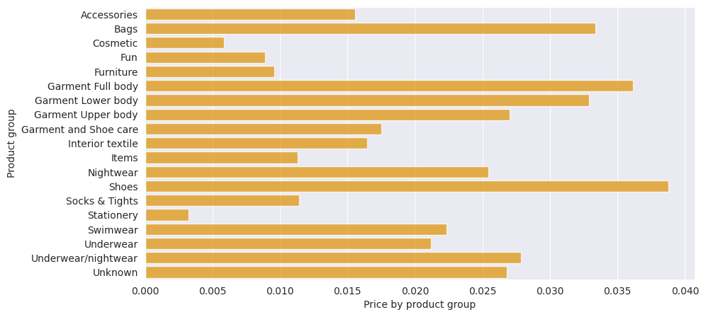

## **Modelling**

### **Collaborative Filtering (CF)**
Collaborative Filtering is used to recommend articles based on historical transaction data. The model identifies similar users based on their past purchases and recommends items that similar users have bought.

#### Model Details:
1. The CF model uses a tuned SVD (Singular Value Decomposition) algorithm to decompose the user-item interaction matrix into latent factors representing user preferences and item characteristics.
2. The final model achieved an RMSE (Root Mean Squared Error) score of 0.0115 during training.

#### Usage:
The CF system takes a customer's unique ID as input and returns a list of recommended articles based on their purchase history in comparison with other users.

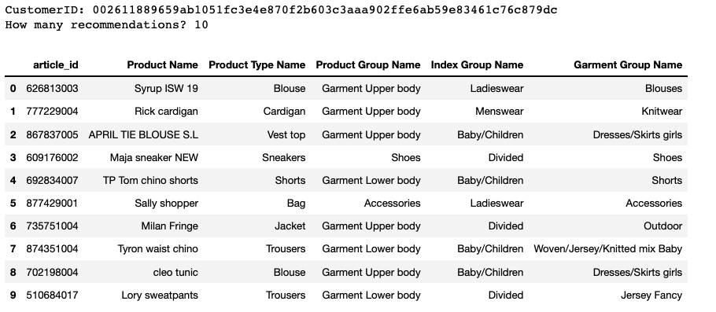

### **Content-Based Filtering (CB)**
Content-Based Filtering recommends articles based on their metadata (e.g., garment group name, product type). It uses article features to find similar items to those previously purchased by the customer.

#### Model Details:
1. Metadata such as garment group name, product group name, and index group name are used to build item profiles.
2. The CB system returns recommendations based on similarity between item profiles using cosine similarity or other distance metrics.

#### Usage:
The CB system takes an article ID as input and returns similar articles based on shared features.

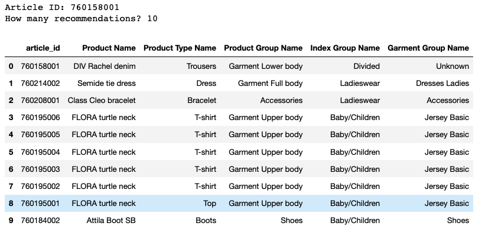

## **Cold Start & Matrix Sparsity**
To address cold start issues (when new users or items enter the system without prior interaction data), we employ a dual approach:
1. **Cold Start for Users**: Content-based filtering can be used for new users by recommending items similar to those they initially browse or interact with.
2. **Cold Start for Items**: New items can be recommended using metadata in content-based filtering until enough transaction data is available for collaborative filtering.

Matrix sparsity is addressed through matrix factorization techniques like SVD in collaborative filtering models and autoencoders in advanced models to fill in missing interactions in sparse datasets.

## **Evaluation**

### Evaluation Metrics
To evaluate both collaborative filtering and content-based models, we use metrics like Precision@K, Recall@K, and F1-score@K:

- **Precision@K**: Measures how many of the top-K recommended items are relevant.
- **Recall@K**: Measures how many relevant items were retrieved from all possible relevant items.
- **F1-score@K**: Harmonic mean of precision and recall; balances both metrics.

#### Collaborative Filtering Results:
- Precision@5: 0.80
- Recall@5: 1.00
- F1-score@5: 0.89

#### Content-Based Filtering Results:
- Precision@5: 0.60
- Recall@5: 1.00
- F1-score@5: 0.75

## **Advanced Model: Autoencoder-Based Collaborative Filtering**

An autoencoder-based collaborative filtering model was implemented to improve performance further by learning complex patterns in user-item interactions.

### Model Architecture:
1. An autoencoder neural network was built with an encoder-decoder structure to compress user-item interactions into latent representations.
2. The encoder consists of fully connected layers with SELU activation functions followed by dropout layers to prevent overfitting.
3. The decoder reconstructs the original input from latent space representations.

### Training & Validation:
The model was trained using Mean Squared Error (MSE) loss with an Adam optimizer to minimize reconstruction errors between predicted interactions and actual interactions.

## Closing Remarks

This project successfully built a recommendation system using both collaborative filtering and content-based approaches while addressing cold start problems through hybrid modeling techniques like autoencoders.